# Gravai

**Audio Capture & AI Meeting Intelligence for macOS**

Gravai is a privacy-first macOS application that captures, transcribes, and summarizes your meetings — entirely on-device. No cloud. No bots. No data leaving your Mac.

One app to record multi-source audio, get real-time transcription, generate AI summaries, and build a searchable archive of every conversation.

---

## Why Gravai?

Most meeting tools force a trade-off: send your audio to the cloud for good AI, or keep it local with limited features. Meanwhile, podcasters and streamers juggle separate apps for capture and transcription.

Gravai eliminates the compromise:

- **Multi-source audio capture** — record microphone + any app's audio simultaneously
- **On-device transcription** — Whisper runs locally on Apple Silicon, no internet required
- **AI meeting summaries** — TL;DR, action items, key decisions via local LLM (Ollama)
- **Privacy by design** — zero network calls unless you explicitly opt into BYOK APIs
- **No virtual mic** — Gravai never injects audio into other apps or appears as a system device

---

## Screenshots

Gravai uses a dark, macOS-native shell: sidebar navigation, central workspace, and a live transcript column when recording.

### Recording

Live session with dual sources (microphone + system audio), VU meters, meeting summary controls, and a scrolling transcript with speaker labels (You / Remote) and optional tone tags.

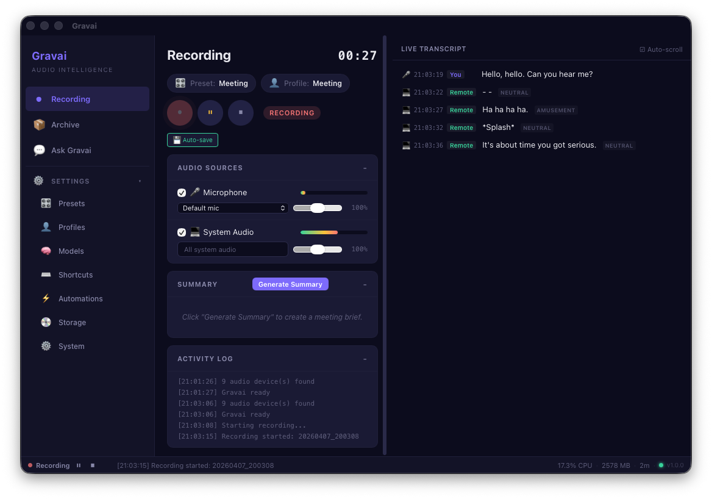

Idle state: preset and profile pickers, transport controls, per-source levels, activity log, and an empty transcript pane until you speak.

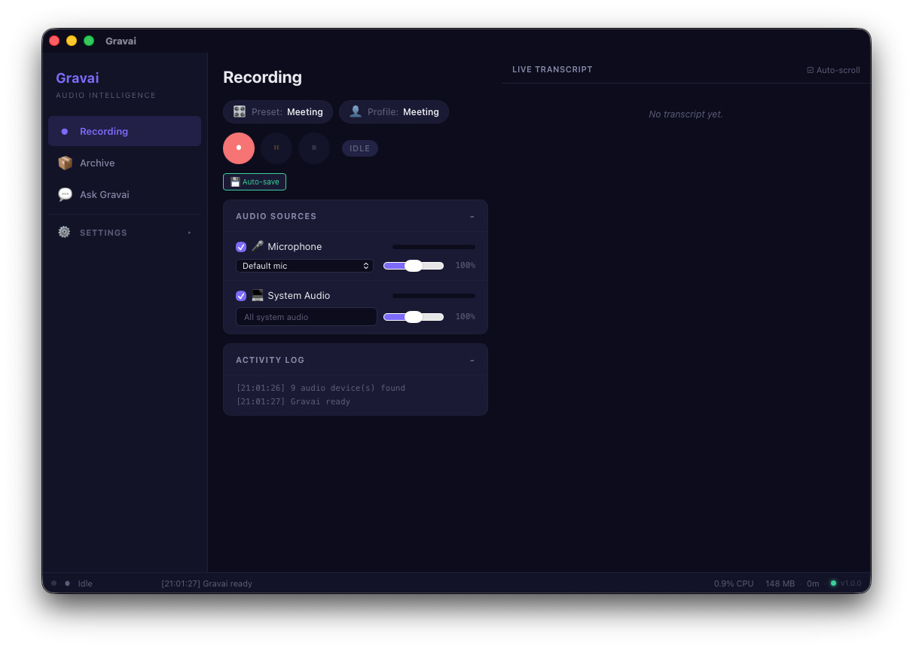

### Archive & Ask Gravai

Search past sessions by keyword or semantic mode, open a transcript in the preview pane, and jump into **Ask Gravai** for RAG-style Q&A with citations back to source meetings.

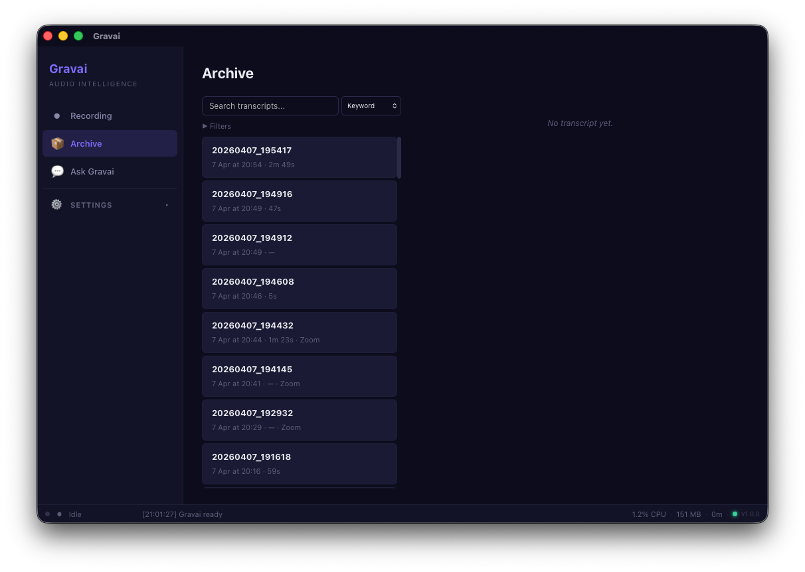

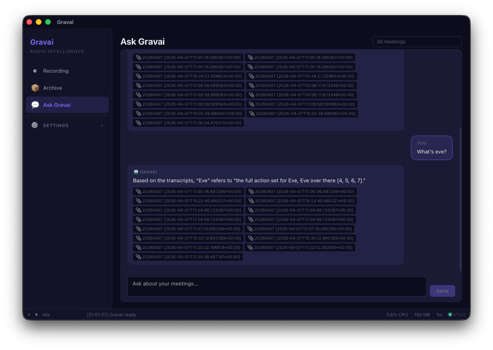

### Capture presets & profiles

**Presets** bundle capture sources, quality, and export format (Meeting, Podcast, Streaming, and custom). **Profiles** layer transcription model, language, diarization, and LLM settings so you can switch whole stacks in one click.

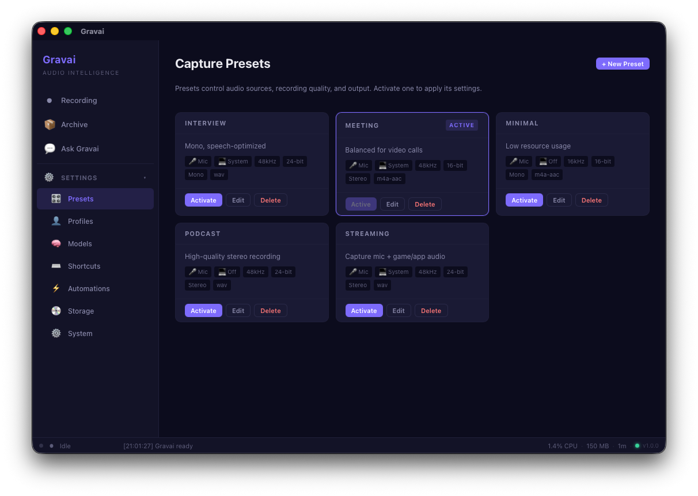

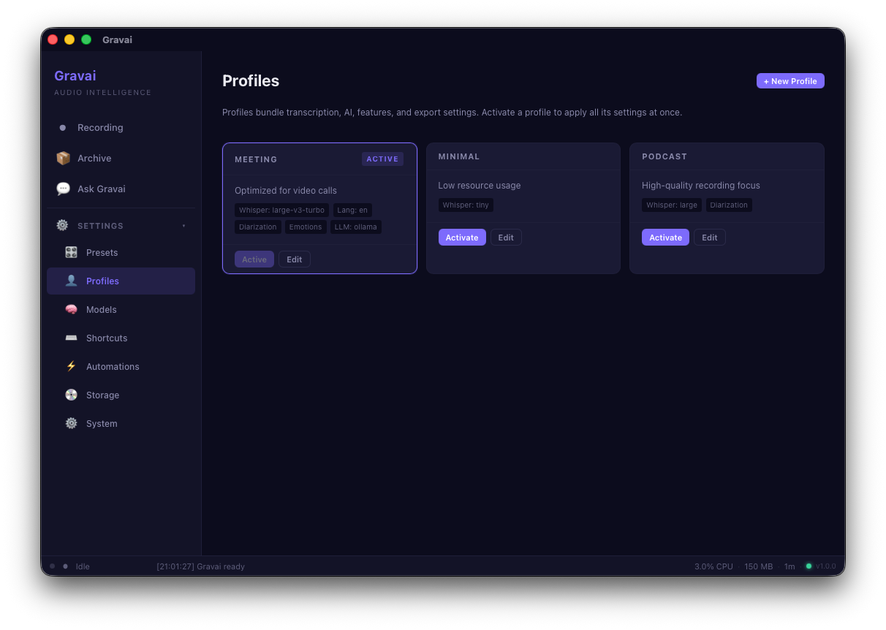

### Models, shortcuts, automations

Download and manage Whisper weights (and Silero VAD), record global shortcuts for start/stop/pause, and wire triggers such as meeting detection or session end to exports and recording.

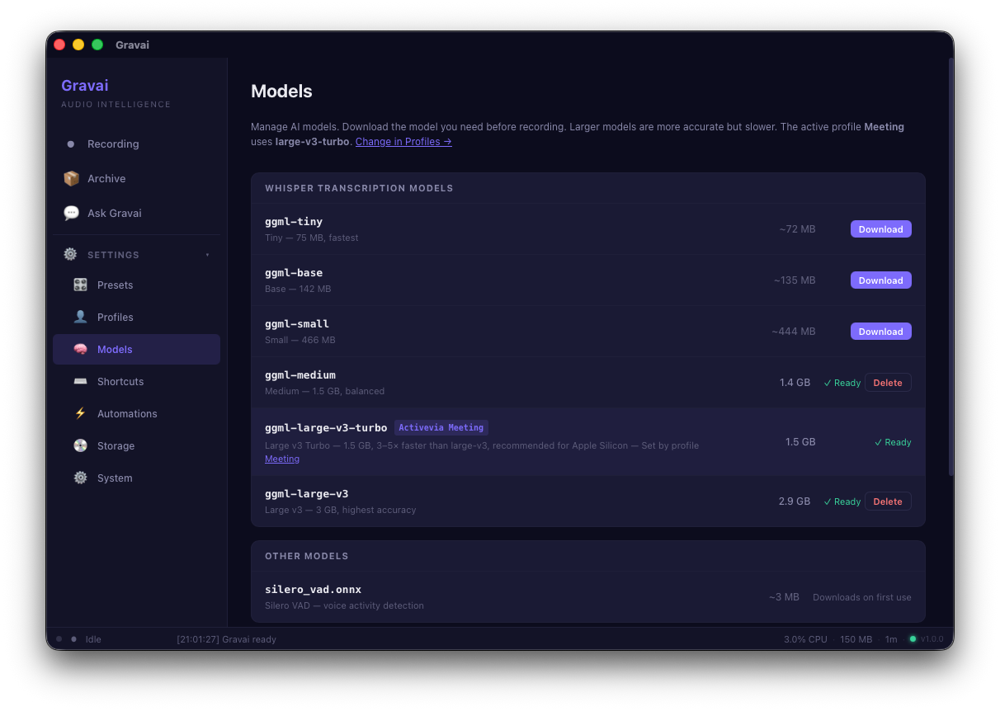

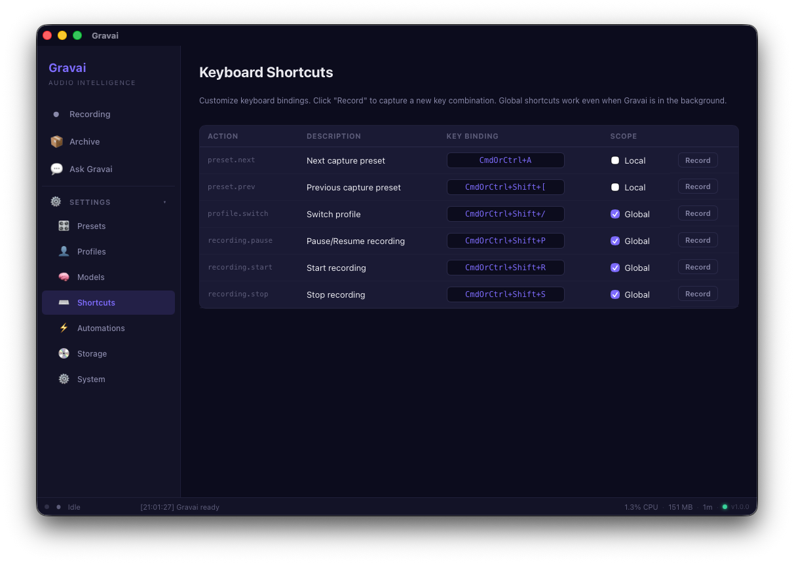

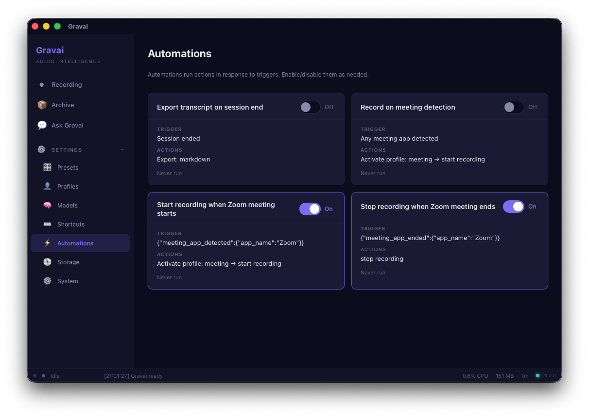

### Storage & system health

Inspect disk use per session, delete audio or full sessions, and run preflight-style checks (platform, data directory, devices, models, memory) from **System** settings.

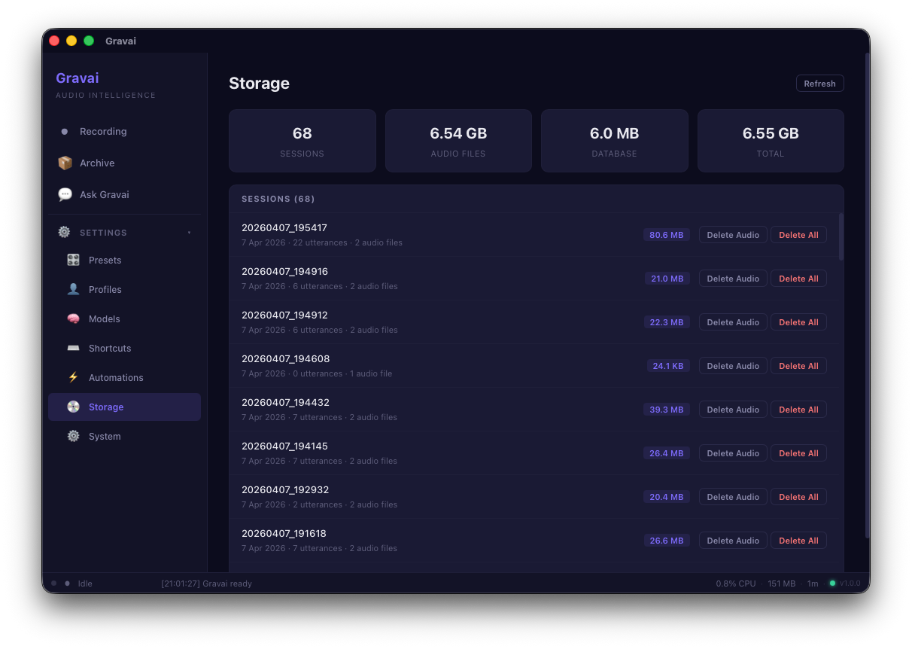

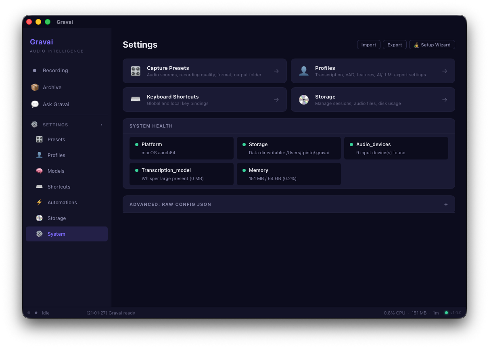

---

## Features

### Recording
- Capture from any microphone + system audio (per-app or all apps)
- Multi-track WAV recording at 48kHz/24-bit stereo
- Per-source volume control and VU metering
- Real-time voice activity detection (WebRTC or Silero)
- Configurable export: WAV, AIFF, CAF, M4A (AAC/ALAC)

### Transcription
- On-device Whisper (tiny through large models)
- Real-time live transcript with <3s latency
- Speaker identification: "You" (mic) vs remote participants (system audio)
- Hallucination filtering and echo suppression
- Multi-language: EN, PT, ES, FR, DE, PL, JA, auto-detect

### AI Intelligence
- Meeting summaries: TL;DR, key decisions, action items, open questions
- Ask Gravai: RAG-powered Q&A over your meeting archive
- Semantic search across all transcripts
- Speaker diarization for remote participants
- Local LLM via Ollama (gemma3:4b default) or BYOK (OpenAI, Anthropic)

### Organization
- Searchable archive with keyword, semantic, and hybrid search
- Calendar integration for auto-naming sessions
- Meeting detection (Zoom, Teams, Slack, Discord, FaceTime)
- Capture presets (Meeting, Podcast, Streaming, Interview, Minimal)
- Profiles to switch entire configurations in one click
- Customizable keyboard shortcuts with key recording
- Automation rules (trigger → condition → action)

### Export
- Markdown with YAML frontmatter
- PDF (via macOS textutil)
- Obsidian vault integration
- Notion API push
- Silence trimming (non-destructive)
- Auto-export on session end via automations

---

## Architecture

```
gravai/
  crates/
    gravai-core          # AppState, EventBus, Session FSM, error types, logging, preflight, perf
    gravai-audio         # cpal + ScreenCaptureKit capture, resampler, recorder, mixer, VAD, pipeline, echo, silence
    gravai-transcription # TranscriptionProvider trait, WhisperEngine, HTTP provider stub
    gravai-intelligence  # LLM client, summarization, diarization, embeddings, RAG chat, prompts
    gravai-config        # Versioned JSON config, presets, profiles, shortcuts, automations
    gravai-storage       # SQLite (sessions, utterances, FTS5, embeddings, chat), migrations
    gravai-models        # Model downloader (Whisper, Silero VAD from HuggingFace)
    gravai-export        # Markdown, PDF, Obsidian, Notion exporters
    gravai-meeting       # Meeting detection (process polling), calendar integration (osascript)
  src-tauri/             # Tauri v2 app: 47 commands, event bridge, plugins
  src-frontend/          # Svelte 5 UI: 8 pages, 3 components, stores
```

**Tech stack:**
- **Backend:** Rust (9 crates, 7,300+ LOC)
- **UI Framework:** Tauri v2 + Svelte 5 (2,200+ LOC, 98 KB bundle)
- **Audio:** cpal (microphone), ScreenCaptureKit (system audio), rubato (resampling), hound (WAV)
- **Transcription:** whisper-rs (whisper.cpp bindings)
- **ML Inference:** ORT/ONNX Runtime (Silero VAD, diarization)
- **LLM:** OpenAI-compatible API (Ollama, OpenAI, Anthropic)
- **Storage:** SQLite with FTS5 full-text search + vector embeddings
- **Templates:** Minijinja (Jinja2-compatible prompt templates)

---

## Quick Start

### Prerequisites
- macOS 13+ (Ventura or later)
- Apple Silicon (M1/M2/M3/M4) recommended
- [Rust toolchain](https://rustup.rs/) (1.75+)
- [pnpm](https://pnpm.io/) (Node.js package manager)
- [Ollama](https://ollama.ai/) (optional, for AI summaries)

### Install & Run

```bash
# Clone
git clone https://github.com/madpin/gravai.git
cd gravai

# Install frontend dependencies
pnpm install

# Run in development mode (builds Rust + starts Vite dev server)
pnpm tauri dev

# Or build for production
pnpm tauri build
```

The app will:
1. Download the Whisper transcription model on first launch (~1.5 GB for medium)
2. Run preflight checks (platform, audio devices, storage)
3. Show the onboarding wizard on first run

### First Recording

1. Select your microphone from the dropdown
2. Optionally enable system audio and pick an app to capture
3. Click the red Record button
4. Speak — live transcription appears in real-time
5. Click Stop when done
6. Click "Generate Summary" to create an AI brief (requires Ollama running)

---

## Configuration

All settings are accessible from the Settings page with auto-save. Configuration is stored at `~/.gravai/config.json`.

| Category | Key Settings |
|---|---|
| **Audio** | Sample rate, bit depth, channels, export format, output folder, recording on/off |
| **Transcription** | Engine (Whisper/HTTP), model size, language |
| **VAD** | Engine (WebRTC/Silero), pause duration, min/max utterance length |
| **Features** | Echo suppression, meeting detection, diarization |
| **AI/LLM** | Provider (Ollama/OpenAI/Anthropic), model, API URL |

Import/export configuration as JSON for backup or team sharing.

---

## Privacy & Security

Gravai is designed around a simple principle: **your data stays on your device**.

- All transcription runs on-device via Whisper — no audio is sent to any server
- Screen Recording permission is only requested when you start recording with system audio
- Meeting detection uses `ps` (process list) — no ScreenCaptureKit permission needed for detection
- LLM summaries default to local Ollama — network is only used if you explicitly configure BYOK APIs
- Calendar access is optional and uses osascript (AppleScript)
- No telemetry, no analytics, no accounts

For App Store distribution:
- Sandbox entitlements: microphone, screen capture (on demand), network client, calendars
- Apple Privacy Manifest included (`PrivacyInfo.xcprivacy`)

---

## Project Status

**Version 1.0.0** — All 5 development phases complete.

| Phase | Status | Features |
|---|---|---|
| Phase 0: Foundation | Done | Workspace, Tauri shell, core abstractions, SQLite, CI |
| Phase 1: Audio Capture | Done | Multi-track recording, dual-rate pipeline, VAD, VU meters |
| Phase 2: Transcription | Done | Whisper engine, live transcript, meeting detection, calendar |
| Phase 3: Intelligence | Done | AI summaries, diarization, presets, profiles, shortcuts, automations |
| Phase 4: Search & Export | Done | Semantic search, RAG chat, Markdown/PDF/Obsidian/Notion export |
| Phase 5: Polish | Done | Silence trimming, onboarding, accessibility, App Store prep, iOS planning |

**47** Tauri commands | **34** tests | **9** Rust crates | **8** UI pages

---

## Development

```bash
# Run tests
cargo test --workspace --lib

# Lint
cargo clippy --workspace -- -D warnings

# Format
cargo fmt --all

# Type-check frontend
pnpm typecheck

# Build production app
pnpm tauri build
```

### Project Structure

```
crates/gravai-core/src/
  app_state.rs     # Arc<AppState> with RwLock fields
  event_bus.rs     # Typed GravaiEvent enum + broadcast channel
  session.rs       # AtomicU8 state machine (Idle → Recording ↔ Paused → Stopped)
  error.rs         # GravaiError enum with thiserror
  logging.rs       # Ring buffer + file + stderr tracing subscriber
  preflight.rs     # Platform, storage, devices, model health checks
  perf.rs          # Memory usage, uptime monitoring

crates/gravai-audio/src/
  capture.rs       # AudioCaptureManager (cpal + ScreenCaptureKit)
  resampler.rs     # 48kHz stereo → 16kHz mono via rubato
  recorder.rs      # Multi-track WAV writer (24-bit PCM)
  pipeline.rs      # VAD-triggered transcription loop
  echo.rs          # Sørensen-Dice echo suppression
  silence.rs       # RMS-based silence detection + trimming
  vad/             # WebRTC + Silero VAD providers
  encoder.rs       # WAV/AIFF/CAF/M4A export via afconvert

src-frontend/
  App.svelte       # Root layout with sidebar navigation
  pages/           # Recording, Archive, Chat, Presets, Profiles, Shortcuts, Automations, Settings
  components/      # TranscriptView, AppPicker, Onboarding
  lib/             # Svelte stores, Tauri API wrappers
```

---

## Acknowledgments

Gravai builds on patterns proven in [ears-rust-api](https://github.com/madpin/ears-rust-api) — the audio capture, session lifecycle, VAD, and transcription pipeline architectures are ported and extended from that project.

Key dependencies:
- [Tauri](https://tauri.app/) — native app framework
- [Svelte](https://svelte.dev/) — reactive UI
- [whisper-rs](https://github.com/tazz4843/whisper-rs) — whisper.cpp Rust bindings
- [cpal](https://github.com/RustAudio/cpal) — cross-platform audio
- [screencapturekit-rs](https://github.com/nicegram/nicegram-ios) — macOS system audio
- [Ollama](https://ollama.ai/) — local LLM inference

---

## License

MIT

---

*Built with Rust, Svelte, and a belief that your conversations belong to you.*
